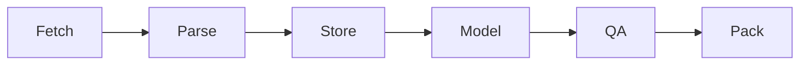

# Do deep research on Tencent 0700.HK

## Executive summary
Pack: KPIs→DCF+comps; QA+backtest.citeturn0search0turn0search1turn0search2

## Sources table
|P|URL|
|---|---|
|1|`https://www.tencent.com/en-us/investors/financial-news.html`|
|2|`https://www1.hkexnews.hk/` ; `https://www.hkexnews.hk/sdw/search/mutualmarket.aspx?t=hk`|
|3|`https://www.sfc.hk/en/Regulatory-functions/Market/Short-position-reporting`|
|4|`https://stockanalysis.com` ; `https://ca.investing.com` ; `https://tipranks.com` ; `https://reuters.com` ; `https://ft.com`|

## Pipeline, repo, QA
KPIs: seg rev, GM, OPM, non‑IFRS, FCF, capex, net cash/debt, shrs, buybacks, dividend. DCF: Base/Bad/Extreme + sens (WACC×g); comps (+SOTP). Cadence: filings M; SFC W; CCASS D. Store: Parquet/CSV; PNG; scripts. Repo: nb/src/data/tests; CI(pytest). QA: tie‑outs; Backtest: forecast→actual; stress.

Assumptions (set): WACC, terminal g, horizon, tax.

## Deliverables tables
|When|Deliverable|
|---|---|
|2w|MVP: KPIs + comps|
|6–8w|DCF+sens, QA, report|

|Output|Format|
|---|---|
|Data+valuation|CSV+Parquet|
|Charts|PNG|
|Notebook|.ipynb|