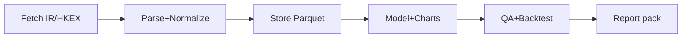

Do deep research on Tencent (0700.HK). **Exec summary:** Build a repeatable pipeline that (1) ingests primary filings, (2) standardizes segment/margin/FCF metrics, (3) produces a 3‑scenario valuation (base/bad/extreme), and (4) enforces QA + backtests so decisions are auditable.

## Objectives
Value 0700 under **Base/Bad/Extreme** via EBITDA/FCF drivers; output **fair value range + margin of safety**. **Placeholders:** discount rate/WACC, terminal growth, horizon (5–10y), tax, FX, risk premium.

## Sources table (fetch first)
|Pri|Source|URL|
|---|---|---|
|P1|IR earnings PDFs + decks|tencent.com/en-us/investors/financial-news.html citeturn0search4|
|P2|HKEX filings (AR/ESG/results, buybacks)|www1.hkexnews.hk/search/titlesearch.xhtml citeturn0search5|
|P3|Southbound CCASS holdings|hkexnews.hk/sdw/search/mutualmarket.aspx?t=hk citeturn0search2|
|S1|Short interest (HK)|sfc.hk/.../Aggregated-reportable-short-positions... citeturn0search3|
|S2|Policy/news + consensus|reuters.com, ft.com; StockAnalysis/Investing/TipRanks|

## Metrics to collect (quarterly + TTM)
Revenue by segment; gross %, op %, non‑IFRS profit; capex; FCF; net cash/debt; liquidity; share count; buybacks; dividend; SBC; ROIC proxy.

## Model deliverables
3‑scenario **DCF** + sensitivities (WACC×g, margin×growth); **comps** (P/E, EV/EBIT, EV/EBITDA, P/S, PEG); optional **SOTP** (Games/Ads/FinTech/Cloud).

## Data pipeline + repo
Store raw PDFs/HTML + parsed tables as **Parquet/CSV**; version by date; scripts rerunnable. Repo: `data/ raw/ processed/ src/ notebooks/ model/ tests/ reports/ .github/ README.md`; CI: lint+pytest.

## QA / robustness
Reconcile segment sums to total; IFRS vs non‑IFRS bridge; cash-flow tie‑outs; share count vs buybacks; stale‑data checks; rolling forecast vs actuals; stress: ad slump, games shock, capex spike.

## Timeline table
|Phase|Time|Output|
|---|---|---|
|MVP|2w|Data + KPI notebook + comps|
|Full|6–8w|DCF(3), QA suite, backtests, report pack|

## Output formats table
|Output|Format|
|---|---|
|Datasets|CSV+Parquet|
|Charts|PNG|
|Model|Notebook + CSV exports|
|Writeup|MD/PDF|

## Checklist
Fetch→parse→KPI table→scenario assumptions→DCF+sens→comps/SOTP→QA→backtest→final report.