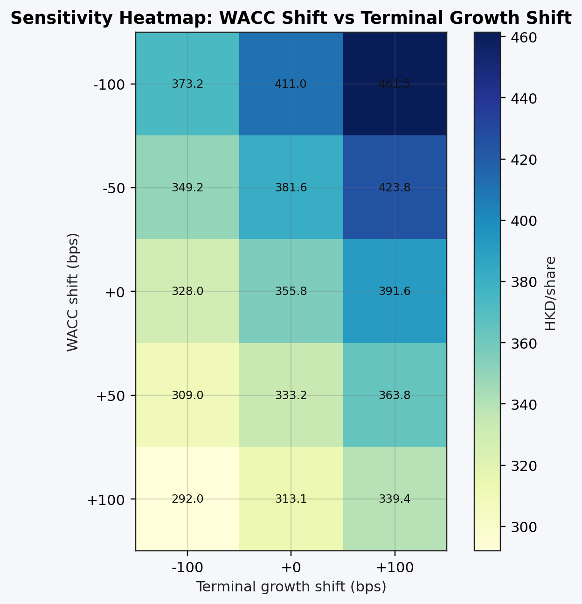
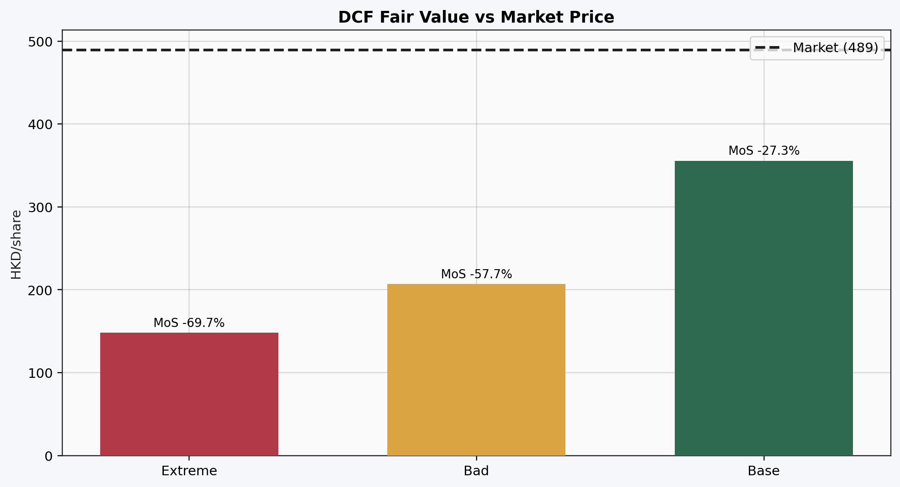
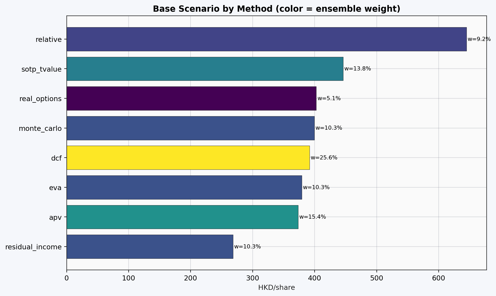

# Tencent Valuation Pipeline (V4)


9-method equity valuation of Tencent Holdings (`0700.HK`).
Built to demonstrate CAPM, DCF, and ensemble valuation mechanics, reproducible from raw data to charts in a single command.

> Project complete. Run with --asof 2026-04-03. 

---

## Result (as of 2026-04-03, spot 489.2 HKD)

| Method | Fair Value (HKD) | vs. Spot |
|---|---|---|
| **DCF (FCFF, 7-year)** | **391.64** | **−20%** |
| APV | 373.26 | −24% |
| EVA | 379.26 | −22% |
| Monte Carlo (10k paths) | 399.33 | −18% |
| Real Options | 402.64 | −18% |
| Residual Income | 268.35 | −45% |
| SOTP | 445.89 | −9% |
| Relative (peer comps) | 644.89 | +32% |
| **Ensemble (QA-weighted)** | **407.14** | **−17%** |

**Model conclusion:** DCF-based methods cluster at 370–400 HKD. Ensemble fair value of 407 HKD is ~17% below spot, with no margin of safety under base assumptions.

**Key assumptions (base scenario)**

| Parameter | Value |
|---|---|
| WACC | 10.48% |
| Beta (Vasicek-adjusted) | 1.36 |
| Risk-free rate (UST 10Y) | 4.13% |
| Equity risk premium | 4.63% |
| Country risk premium | 1.25% |
| Terminal growth rate | 3.5% |
| Revenue growth (Yr 1→7) | 8% → 5.5% |
| EBIT margin (Yr 1→7) | 36% → 37.4% |
| Scenario probabilities | Base 50% / Bad 35% / Extreme 15% |

---

## Charts

**DCF sensitivity: WACC vs. terminal growth rate**



**DCF scenarios vs. market price**



**All 9 methods — base scenario cross-section**



---

## Methods

| Layer | What it does |
|---|---|
| **WACC engine** | CAPM (official) + APT/Fama-French 3-factor (diagnostic), Vasicek beta adjustment, CRP add-on |
| **DCF** | 7-year FCFF projection, 3 scenarios (base / bad / extreme), WACC-discounted |
| **APV** | DCF + PV of interest tax shields, Modigliani-Miller framework |
| **Residual Income** | Excess return over cost of equity, from book value |
| **EVA** | NOPAT vs. invested capital charge |
| **SOTP** | Segment revenue × peer multiples (Gaming, FinTech, Cloud, Ads) |
| **Relative** | P/E, EV/EBIT, P/FCF comps across 5 HK-listed peers |
| **Monte Carlo** | 10,000 paths, stochastic revenue growth + margin |
| **Real Options** | Binomial tree on growth optionality |
| **Ensemble** | QA-gated weighted average; 27 checks, investor-grade gate |

---

## Repo Structure

```
README.md                        ← results + charts (start here)
docs/INVESTMENT_REPORT.md        ← thesis and decision narrative
docs/MODEL_ASSUMPTIONS.md        ← full assumptions register
docs/figures/2026-04-03/         ← 11 charts
src/tencent_valuation_v4/        ← all pipeline code
config/                          ← YAML config (WACC, scenarios, weights, QA gates)
scripts/                         ← run_model.sh, generate_v4_visuals.py
tests/                           ← test suite
data/raw/<asof>/                 ← raw snapshots (not committed)
```

---

## Data Sources

| Input | Source |
|---|---|
| Tencent financials (TTM) | Tencent IR quarterly filings + stooq FX |
| UST yield curve | FRED |
| Market / factor data | Public market data (live mode) |
| Peer capital structure | HKEX annual reports (FY2025, StockAnalysis) |
| Peer P&L multiples | yfinance TTM statements |


---

## QA

27 checks across WACC inputs, DCF mechanics, ensemble weights, and output sanity.
Last run: `0 warnings / 0 failures`
