# Tencent Valuation V4 Storybook (Publishable Snapshot)

As-of date: `2026-03-19`  
Pipeline line: `main` (V4)  
Primary objective: decision-grade investment narrative with visual evidence

## 1) Conclusion

At this snapshot, the model indicates Tencent is **priced above intrinsic value** under the current base assumptions.

- Market price: `HKD 533.00/share`
- Base DCF fair value: `HKD 176.39/share` (`-66.9%` margin of safety)
- Expected ensemble fair value: `HKD 170.69/share` (`-68.0%` margin of safety)
- Investment stance from this model state: `defensive / wait for reset or stronger fundamentals`

The market-implied assumptions are materially above base model assumptions (reverse DCF implies very high required terminal growth and operating upside).

## 2) Assumptions

### 2.1 Cost of Capital Assumptions

| Assumption | Value |
|---|---:|
| Risk-free rate (`Rf`) | `2.26%` |
| Equity risk premium (`ERP`) | `15.78%` |
| Country risk premium (`CRP`) | `1.25%` |
| Levered beta (Vasicek-adjusted) | `1.040` |
| CAPM cost of equity (`Re`) | `19.93%` |
| APT cost of equity (diagnostic) | `13.36%` |
| Cost of debt (`Rd`) | `3.76%` |
| Target D/E | `0.231` |
| Tax rate | `20.0%` |
| Official WACC | `16.75%` |
| CAPM-APT gap | `656.7 bps` |

### 2.2 Base Operating Assumptions

Model structure:
- Forecast horizon: `7 years`
- Scenarios: `base`, `bad`, `extreme`
- Terminal growth and margin assumptions are scenario-dependent
- Mid-year discounting enabled in DCF

Base scenario path (high-level):
- Revenue growth starts near `8.0%` and steps down over horizon
- EBIT margin trends from `~36%` toward high-30s range
- Capex, NWC, and SBC are scenario-bound using config rules (`scenario_assumptions_used.csv`)

## 3) Base Case Results

| Scenario | DCF Fair Value (HKD/share) | Ensemble Fair Value (HKD/share) | Margin of Safety vs HKD 533 |
|---|---:|---:|---:|
| Base | `176.39` | `198.85` | `-66.9%` (DCF), `-62.7%` (ensemble scenario) |
| Bad | `117.60` | `150.40` | `-77.9%` (DCF), `-71.8%` (ensemble scenario) |
| Extreme | `93.92` | `124.17` | `-82.4%` (DCF), `-76.7%` (ensemble scenario) |
| Probability-weighted expected | - | `170.69` | `-68.0%` |

Reverse DCF at market price implies:
- Implied terminal growth: `13.61%`
- Implied margin shift vs base: `+2000 bps`
- Implied growth shift vs base: `+2000 bps`

Interpretation: current price is consistent with assumptions far above the model base regime.

## 4) Methodology

Valuation stack:
1. DCF (FCFF + terminal value)
2. APV (unlevered value + tax shield)
3. Residual Income
4. Relative valuation (comps)
5. SOTP / T-Value
6. EVA
7. Monte Carlo
8. Real options
9. Ensemble weighting across methods

Model controls:
- Quality gates (`qa`) with pass/warn/fail checks
- Backtest diagnostics (`backtest_summary.csv`, `backtest_point_results.csv`)
- Data contracts for key output schemas

## 5) Visual Evidence Pack

### 5.1 Core valuation gap
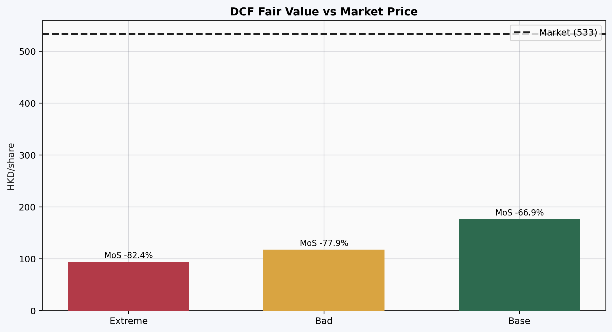

Base, bad, and extreme DCF outputs all sit far below market price.

### 5.2 Ensemble vs DCF
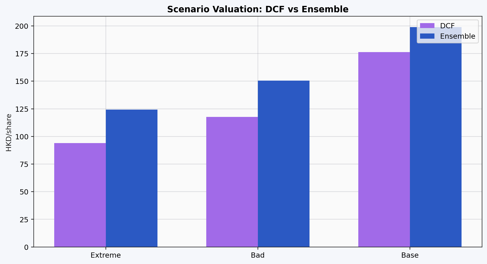

Ensemble lifts fair value versus DCF but still remains well below market across scenarios.

### 5.3 Method cross-section (base)
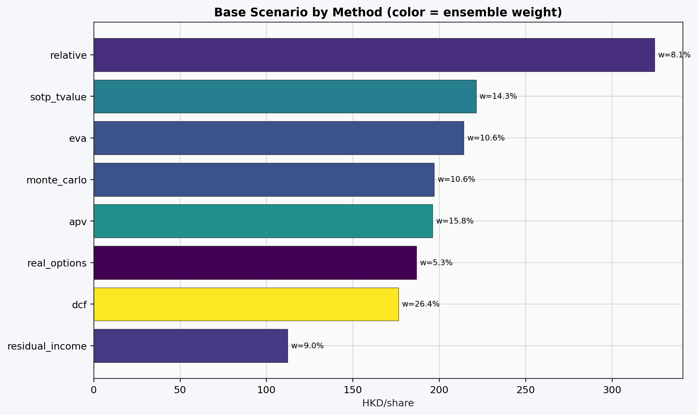

Method spread is wide, but the weighted center remains materially below market.

### 5.4 Cost-of-equity diagnostics
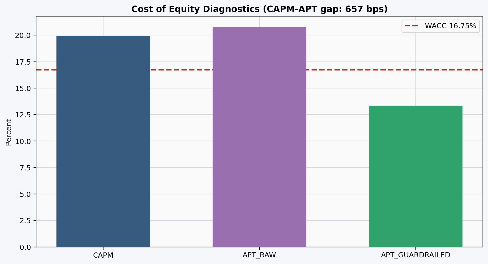

CAPM/APT divergence is large (`656.7 bps`), a key uncertainty signal.

### 5.5 Monte Carlo distribution
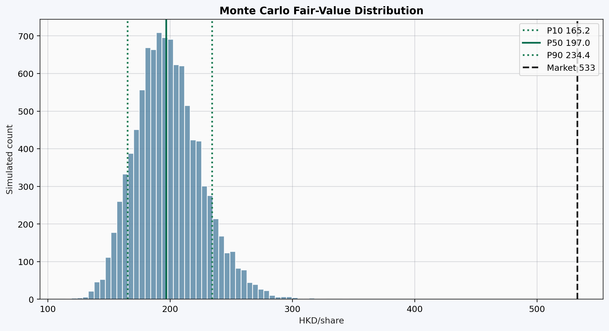

The market price lies far to the right of the simulated fair-value distribution.

### 5.6 Stress scenarios
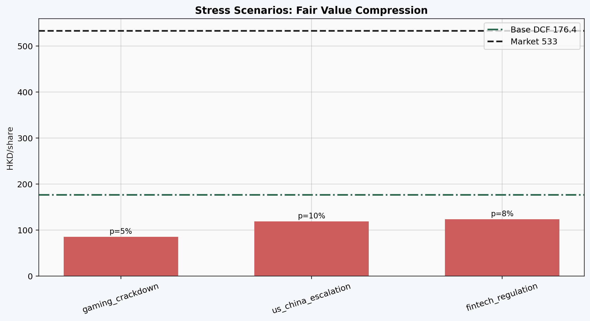

Stress cases compress fair value further, with deep negative margins of safety.

### 5.7 WACC-growth sensitivity
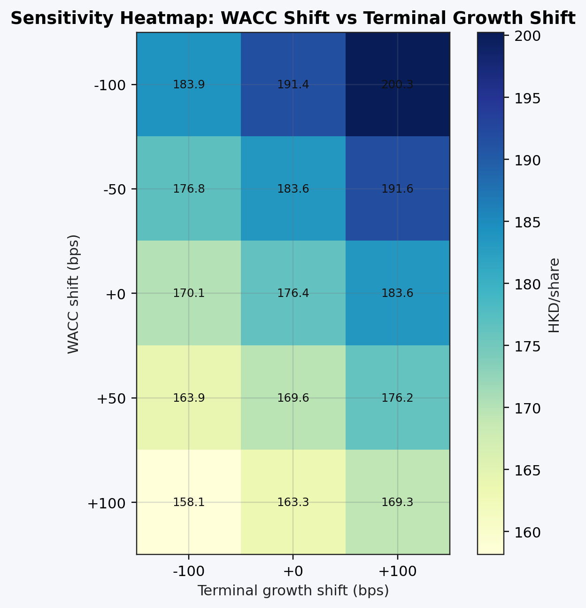

Reasonable perturbations do not bridge the full market-implied gap.

### 5.8 Margin-growth sensitivity
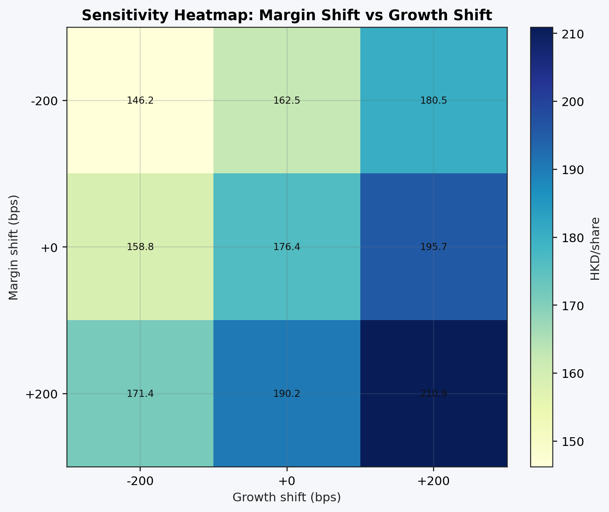

Even optimistic margin/growth shifts leave a substantial shortfall to market.

### 5.9 Backtest signal-quality scatter
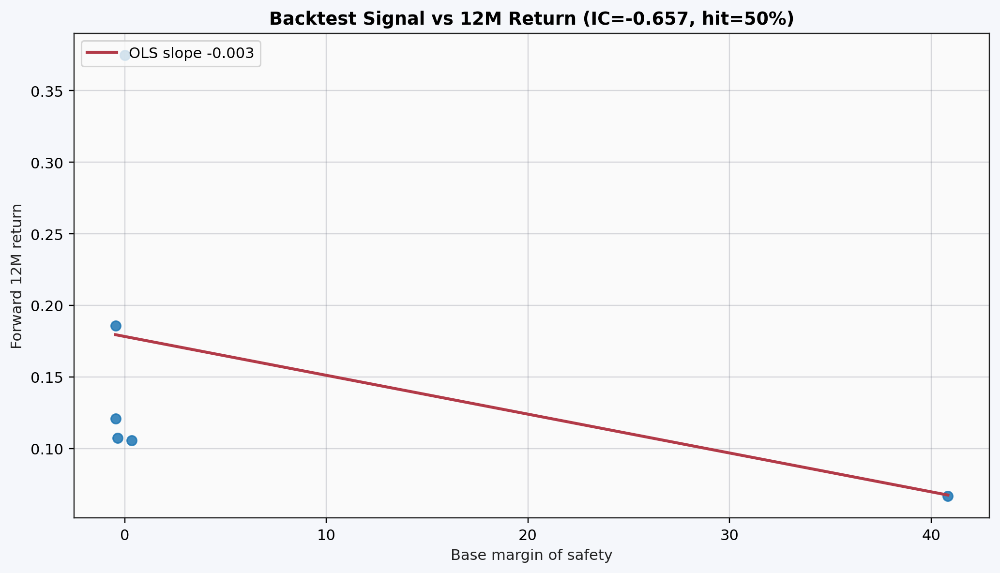

Signal quality is unstable (`IC12m < 0`), reducing confidence in tactical timing.

### 5.10 Regime hit-rate view
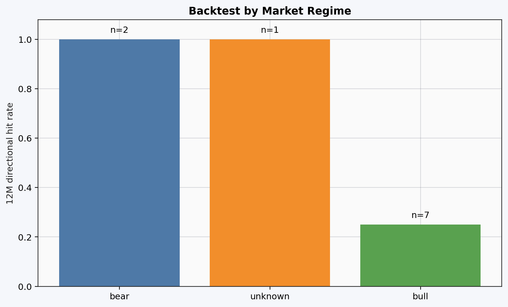

Regime performance is uneven and sample size is small.

### 5.11 Scenario assumption paths
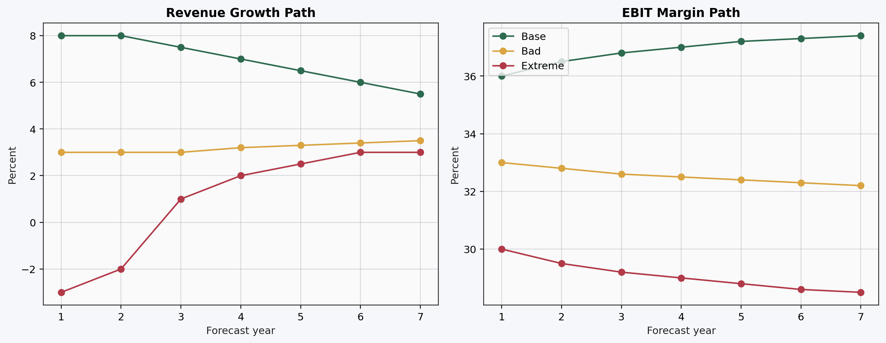

Scenario paths are ordered and economically coherent, but still produce low intrinsic values vs market.

## 6) Validation and Model Quality

QA summary (`reports/qa_2026-03-19.json`):
- Total checks: `27`
- Warnings: `5`
- Failures: `2`
- Investor-grade: `NO`

Key warning/fail themes:
- CAPM-APT gap and APT instability
- ERP outside configured reasonableness band
- Backtest coverage/quality shortfalls and weak calibration

Interpretation: output is usable for directional narrative and scenario framing, but not investor-grade for high-conviction execution without additional data and calibration work.

## 7) Closed-Project Readiness

What is complete:
- End-to-end pipeline runs successfully for snapshot date
- Full test suite passes (`183 passed, 24 skipped`)
- Lint checks pass (`ruff check .`)
- Visual package generated reproducibly via:
  - `python scripts/generate_v4_visuals.py --asof 2026-03-19`

What remains if stricter publish standards are required:
- Replace proxy peer fundamentals with complete peer statements
- Expand backtest sample and improve calibration reliability
- Reconcile ERP/WACC assumptions with a tighter capital-market baseline

## 8) Final Decision Statement

Given this V4 snapshot, the evidence supports a **no-buy / wait** stance at `HKD 533`.
For a bullish thesis, the burden of proof is to justify assumptions materially stronger than the current base path and to close the QA/backtest quality gaps.
